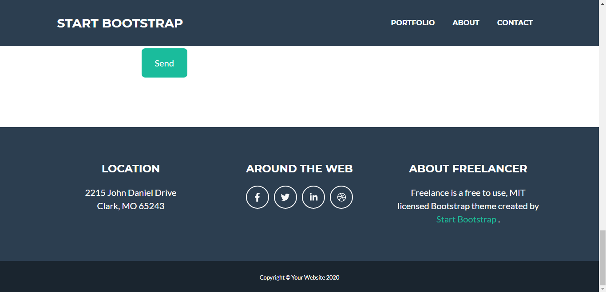
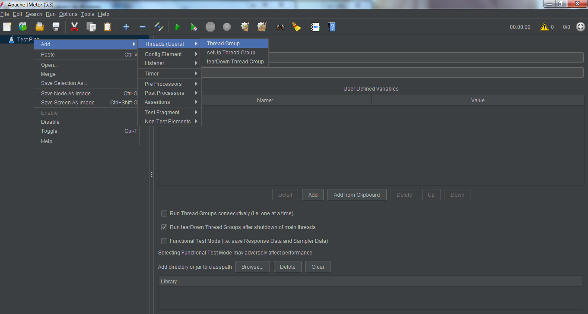
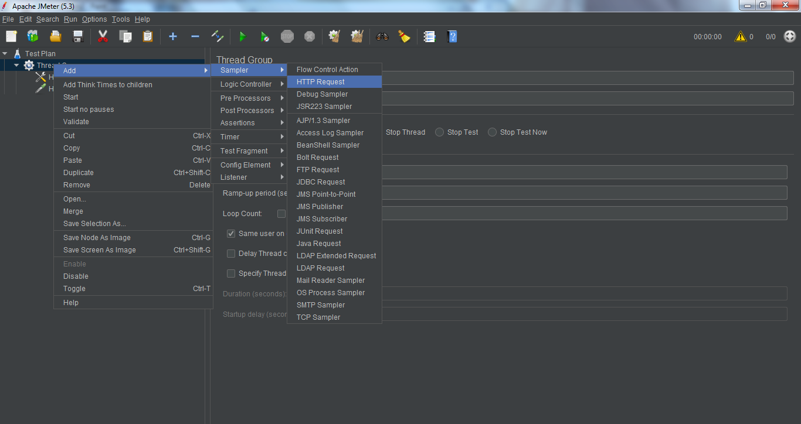
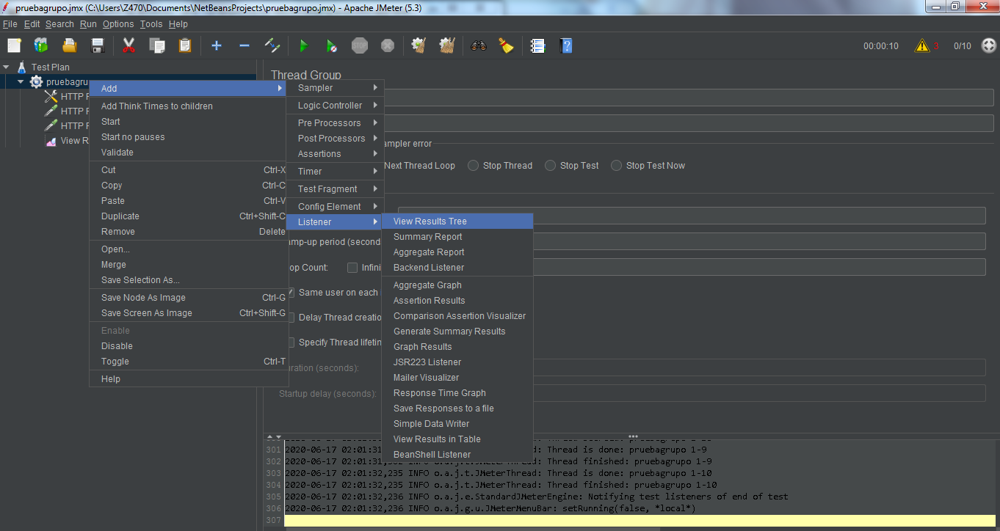
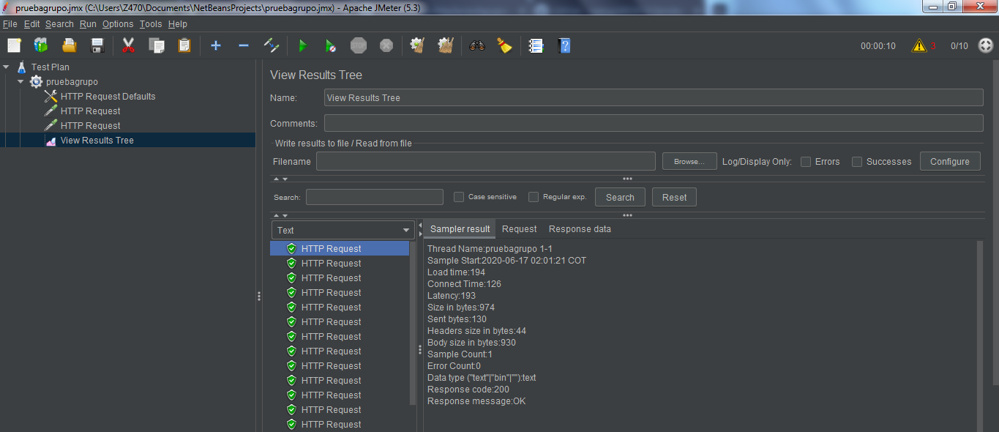
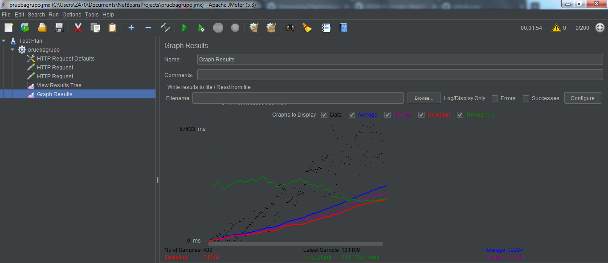
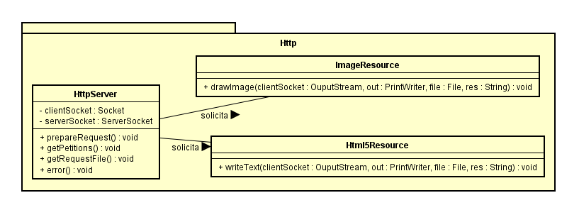

# Concurrencia en servidores Http con Sockets Java

El siguiente repositorio muuestra un servidor con peticiones concurrentes y el manejo de recursos html.

### Prerrequisitos

Para ejecutar con éxito este programa se requiere de los siguientes programas instalados en su máquina.

```
java version: "1.8.0_171"
git version: 2.19.1.windows.1
Apache Maven version: 3.6.3
Apache JMeter version: 5.3 (Opcional)
```

## Instrucciones de uso

Para poder usar el proyecto lo primero que debe realizar es clonar este repositorio utilizando el siguiente comando desde la terminal del S.O que este utilizando:

```
git clone https://github.com/EdKillah/ARSW-Taller4
```
Otra alternativa es descargarlo directamente por formato ZIP en el botón que indica **"Clone or Download".**
Luego debe redirigirse por medio de la terminal al directorio raíz la cual contiene el achivo pom.xml.

Una vez se encuentre en este directorio se debe compilar el programa para esto se debe ejecutar el siguiente comando:

```
mvn package
```

Una vez compliado el repositorio completo se encuentra en posibilidad de probar los siguientes ejercicios:

### EJERCICIO

 Realizar peticiones concurrentes en el servidor

#### Comando para ejecutar:
```
java -cp target/classes edu.escuelaing.arsw.intro.app.tallernetworking.Http.HttpServer
```

Una vez ejecutado el comando se debe ir al navegador de preferencia y entrar a la dirección **localhost:32000/index.html** o **localhost:32000/bs/index.html** para poder ver la ejecución del servidor.

#### Código del programa:

```
package edu.escuelaing.arsw.intro.app.tallernetworking.Http;

/**
 * HttpServer class makes possible the connection between any client and a server
 * thanks to concurrency implemented 
 * @author Eduard Jimenez.
 */
import java.net.*;
import java.io.*;
import java.util.concurrent.ExecutorService;
import java.util.concurrent.Executors;
import java.util.logging.Level;
import java.util.logging.Logger;

public class HttpServer implements Runnable {

    private final Socket clientSocket;
    private ServerSocket serverSocket;

    public HttpServer(final Socket clientSocket) throws IOException {

        serverSocket = null;
        this.clientSocket = clientSocket;

    }

    /**
     * Prepare the connection between server and client
     * @param clientSocket
     * @throws IOException 
     */
    private void prepareRequest(Socket clientSocket) throws IOException {
        PrintWriter out;
        BufferedReader in;

        out = new PrintWriter(clientSocket.getOutputStream(), true);
        in = new BufferedReader(
                new InputStreamReader(
                        clientSocket.getInputStream()));
        String inputLine, outputLine, res = "";
        int contador = 0;
        while ((inputLine = in.readLine()) != null) {
            System.out.println("Received: " + inputLine);
            if (contador == 0) {
                res = inputLine;
                contador++;
            }

            if (!in.ready()) {
                break;
            }
        }
        
        getPetitions(res,out);


        out.close();
        in.close();
    }
    
    /**
     * Validation of request type
     * getPetitions catch FileNotFound exceptions but throws any other IOExeption
     * @param res
     * @param out
     * @throws IOException 
     */
    private void getPetitions(String res,PrintWriter out ) throws IOException{
        String outputLine = "";
        if (res.substring(0, 3).equals("GET")) {
            res = res.substring(5, res.length() - 9);

            File archivoEncontrado = buscarArchivo(res);

            if (archivoEncontrado != null) {
                try {
                    getRequestFile(archivoEncontrado, out, res, clientSocket);
                } catch (java.io.FileNotFoundException ex) {
                    error(outputLine, res,out);
                }
            } else {
                error(outputLine, res,out);
            }
        }        
    }

    /**
     * Makes the call to the class depending on the file's type
     * @param archivoEncontrado
     * @param out
     * @param res
     * @param clientSocket
     * @throws IOException 
     */
    private void getRequestFile(File archivoEncontrado, PrintWriter out,
            String res, Socket clientSocket) throws IOException {

        if (res.contains("png") || res.contains("jpg")) {
            ImageResource imgr = new ImageResource();
            imgr.drawImage(clientSocket.getOutputStream(), out, res, archivoEncontrado);
        } else if (res.contains("html")) {
            Html5Resource texto = new Html5Resource();
            texto.writeText(clientSocket.getOutputStream(), out, archivoEncontrado, "text/html");
        } else if (res.contains(".js")) {
            Html5Resource texto = new Html5Resource();
            texto.writeText(clientSocket.getOutputStream(), out, archivoEncontrado, "text/javascript");

        } else if (res.contains(".css")) {
            Html5Resource texto = new Html5Resource();
            texto.writeText(clientSocket.getOutputStream(), out, archivoEncontrado, "text/css");
        }
        else{
            error("",res,out);
        }
    }

    /**
     * Concats the file name with the root path
     *
     * @param res
     * @return
     */
    private File buscarArchivo(String res) {
        //BuscarArchivo find = new BuscarArchivo();
        return new File(System.getProperty("user.dir") + "\\src\\main\\resources\\" + res); //"index.html"

    }

    public static void main(String[] args) {
        ExecutorService pool = null;
        try {
            ServerSocket serverSocket = new ServerSocket(32000);
            System.out.println("Listo para recibir ...");
            pool = Executors.newCachedThreadPool();
            while (true) {
                Socket socket = serverSocket.accept();
                HttpServer req = new HttpServer(socket);
                pool.execute(req);
            }
        } catch (IOException e) {
            System.err.println("Could not listen on port: 32000.");
            System.exit(1);
        } finally {
            pool.shutdown();
        }

    }

    /**
     * Write an html with an error text.
     * @param outputLine
     * @param res
     * @return 
     */
    private void error(String outputLine, String res, PrintWriter out) {

        outputLine = "HTTP/1.1 200 OK\r\n"
                + "Content-Type: text/html\r\n"
                + "\r\n"
                + "<!DOCTYPE html>"
                + "<html>"
                + "<head>"
                + "<meta charset=\"UTF-8\">"
                + "<title>Title of the document</title>\n"
                + "</head>"
                + "<body>"
                + "<h1>ERROR 404.<p><div style='color:red'>" + res.toUpperCase() + "</div>" + " NO ENCONTRADO</p></h1>"
                + "</body>"
                + "</html>";
        out.println(outputLine);
    }

    public ServerSocket getServerSocket() {
        return serverSocket;
    }

    public void setServerSocket(ServerSocket serverSocket) {
        this.serverSocket = serverSocket;
    }

    @Override
    public void run() {
        try {
            prepareRequest(clientSocket);
        } catch (IOException ex) {
            System.err.println("Run exception while executing thread.");
            Logger.getLogger(HttpServer.class.getName()).log(Level.SEVERE, null, ex);
        }
    }

}


```


#### Código clase ImageResource

```
package edu.escuelaing.arsw.intro.app.tallernetworking.Http;

import java.io.BufferedReader;
import java.io.File;
import java.io.FileReader;
import java.io.IOException;
import java.io.OutputStream;
import java.io.PrintWriter;

/**
 * Class with the responsibility of return HTML5 elements
 * @author Eduard Jimenez
 */
public class Html5Resource {

    /**
     * Write HTML5 components on the clientSocket
     * @param clientSocket
     * @param out
     * @param archivoEncontrado
     * @param type
     * @throws IOException 
     */
    public void writeText(OutputStream clientSocket, PrintWriter out, File archivoEncontrado,String type) throws IOException {
        StringBuilder cadena = new StringBuilder();
        String line = null;
        FileReader prueba = new FileReader(archivoEncontrado);
        BufferedReader reader = new BufferedReader(prueba);

        while ((line = reader.readLine()) != null) {
            cadena.append(line);
        }
        out.println("HTTP/1.1 200 OK");
        out.println("Content-Type: "+type);
        out.println();
        out.println(cadena);

    }

}

```


#### Código clase ImageResource

```
package edu.escuelaing.arsw.intro.app.tallernetworking.Http;

import java.awt.image.BufferedImage;
import java.io.BufferedReader;
import java.io.ByteArrayOutputStream;
import java.io.DataOutputStream;
import java.io.File;
import java.io.FileReader;
import java.io.IOException;
import java.io.OutputStream;
import java.io.PrintWriter;
import java.net.Socket;
import javax.imageio.ImageIO;

/**
 *
 * @author Eduard Jimenez
 */
public class ImageResource {

    public void drawImage(OutputStream  clientSocket,PrintWriter out ,String res, File archivoEncontrado) throws IOException {
        
        if(res.contains("img/")){
            
            res = res.substring(4,res.length());
        }
        BufferedImage image = ImageIO.read(new File("C:\\Users\\Z470\\Documents\\NetBeansProjects\\TallerNetworking\\src\\main\\resources\\img\\"+res)); 
  

        out.println("HTTP/1.1 200 OK");
        out.println("Content-Type: image/png");
        out.println();
        ImageIO.write(image, "PNG", clientSocket);
        
    }
}

```
### Imagenes de muestra

#### html5 básico
La siguiente imagen muestra una alerta que proviene de un codigo *javascript*.


La imagen muestra una página html sencilla con imagenes adjuntas y estilo css brindando un color de fondo.


#### bootstrap template
A continuación se presentan unas imagenes de un template de boostrap gratuito donde se muestra el correcto funcionamiento de código javascript, css y html.
**Nota:** Para poder acceder a los recursos de bootstrap basta con digitar *localhost:32000/bs/index.html* y el servidor redirigirá las páginas automaticamente.

Código de index




#### Página de error sencilla


## Pruebas de ejecución con Apache JMeter

Como se indicó en los prerrequisitos se hará uso del programa JMeter ofrecido por apache para poder realizar pruebas de peticiones a servidores de manera concurrente para comprobar su funcionamiento y eficiencia.
Para esta ocasión se dará por sentado que ya se tiene instalado JMeter en su equipo y se procederá a mostrar un pequeño tutorial de como se realizan las pruebas al servidor que se trata en este repositorio.

Lo primero que se debe hacer es prender el servidor (Este paso se encuentra en las instrucciones de uso en la parte superior).

Luego en JMeter debe dirigirse a la parte superior izquierda y dar click derecho en el botón TestPlan y seguir los pasos como se muestra en la imagen, una vez creada la clase escogeremos

 - el número de peticiones  
 -  el tiempo en segundos que tardará en
   realizar las peticiones .
-    Y las veces que se realizarán.




Luego se añadirá un HttpRequestDefault y un HttpRequest para que reciba las peticiones raíz y algún recurso en especifico.



Ahora procederemos a escoger los diferentes Listeners que ofrece JMeter para analizar la información de manera amigable



Resultados en forma de árbol


Resultados en forma de tabla


Resultados en forma de gráfica



## Diagrama de clases

La siguiente imagen muestra los diagramas de clases que permiten la interacción entre el servidor y las clases encargadas de la lectura de archivos solicitados por el cliente.




## Construido con


* [Maven](https://maven.apache.org/) - Dependency Management
* [Heroku](https://www.heroku.com/) - Heroku
* [Java](https://www.java.com/es/download/) - Lenguaje de programación
* [Git](https://github.com/) - Versionamiento


## Authors

* **Eduard Jimenez** - *LOCS/Hora  626/14 = 44.7 LOCS/Hora* - Fecha: 19/06/2020


## Licencia

This project is licensed under the MIT License - see the [LICENSE.md](LICENSE.md) file for details

